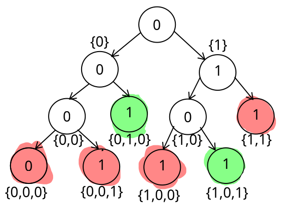
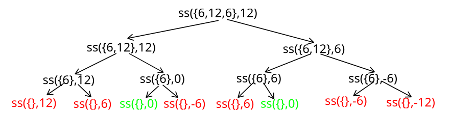

# Suma de subconjuntos BT
Dado un multiconjunto $C = \{c_1, \cdots, c_n\}$ de números naturales y un natural $k$, queremos determinar si existe un subconjunto de $C$ cuya sumatoria sea $k$. Vamos a suponer que $C$ esta ordenado de alguna forma arbitraria pero conocida. Las soluciones (candidatas) son los vectores $a = (a_1, \cdots, a_n)$ de valores binarios; el subconjunto de $C$ representado por $a$ contiene a $c_i$ si y solo si $a_i = 1$. Luego, $a$ es una solución valida cuando $\sum^{n}_{i=1} {a_i c_i} = k$. Asimismo, una solución parcial es un vector $p = (a_1, \cdots, a_i)$ de números binarios con $0 \leq i \leq n$. Si $i< n$, las soluciones sucesoras de p son $p \oplus 0$ y $p \oplus 1$, donde $\oplus$ indica concatenación.

Ejemplo

Digamos que te doy el conjunto de números $C = \{3,7,2,5\}$ en este caso $n = 4$ porque hay 4 elementos.

El problema de "Suma de subconjutos" nos pied encontrar una combinación de estos números que sume un valor específico $k$. 

Para indicar a la computadora que elementos elegimos para formar nuestro subconjunto y cuals no, usamos un vector de valores binarios de la mismalongitud que $C$. A este vector le llamamos $a$.

+ Si $a_i = 1$, significa que sí incluimos el número de la posición $i$ en nuestro subconjunto.
+ Si $a_i = 0$, significa que NO lo icluimos

Supongamos que nuestra "solución candidata" es el vector $a = (1,0,1,0)$. Entonces, el vector a representa al subconjunto $\{3,2\}$. La suma de esa solución candidata sería: $3 + 2 = 5$.

Si el valor $k$ es 5 entonces la solución candidata es correcta.

> Basicamente, los vcotres inarios son como interruptores (On/Off) para cada número del conjunto original, donde 1 es "Lo agarro" y 0 es "lo dejo". En algoritmos de `Backtraking`, lo que la computadora hace es ir progando todas las combinaciones posibles de ceros y unos hasta encontrar la que suma $k$.


1. Escribir el conjunto de soluciones candidatas para $C = \{6, 12, 6\}$ y $k = 12$

{{0,0,0}, {0,1,0}, {1,0,0},{1,0,1},{0,1,1}}

2. Escribir el conjunto de soluciones válidas para $C = \{6, 12, 6\}$ y $k = 12$
{{1,0,1}, {0,1,0}}

3. Escribir el conjunto de soluciones parciales para $C = \{6, 12, 6\}$ y $k = 12$
{{0},{0,1},{0,1,0},{1},{1,0},{1,0,1}}
4. Dibujar un árbol de backtraking correspondiente al algoritmo descrito para $C = \{6, 12, 6\}$ y $k = 12$, indicando claramente la relación entre las distintas componentes del árbol y los conjuntos de los insisos anteriores.


5. Sea $C$ la familia de todos los multiconjuntos de números naturales. Considerar la siguiente función recursiva $ss: C \times \mathbb{N}_0 \to \{V, F\}$.

$ss(\{c_1, \cdots, c_n\}, k) = 
\begin{cases}
k = 0 & \text{si} \ n = 0 \\
ss(\{c_1, \cdots, c_{n-1}\}, k) \ \lor ss(\{c_1, \cdots, c_{n-1}, k - c_n\}) & \text{si} \ n > 0 
\end{cases}
$

Converserse de que $ss(C,k) = V$ si y sólo si el problema tiene solución válida para la entrada $C,k$. Para ello, observar que hay dos posibilidades para una solución valida $a = \{a_1, \cdots, a_n\}$ para el caso $n > 0$: o bien $a_n = 0$ o bien $a_n = 1$.

+  En el primer caso, existe un subconjunto de $\{c1, \cdots, c_{n-1}\}$ que suma $k$.
+  En el segundo, existe un subconjunto de  $\{c1, \cdots, c_{n-1}\}$ que suma $k - c_n$.

6. Convencerse de la siguiente implementación recursiva de $ss$ en lenguaje imperativo y de que retorna la solución para $C,k$ cuando se llama con $C, |C|, k$. ¿Cuál es su complejidad?

```haskell
subset_sum(C, i, j):
    Si i = 0, retornar j = 0;
    Si no, retornar subset_sum(C, i-1, j) V subset_sum(C, i-1, j - C[i]);
```
Como tal el peor caso se recorrerian todas las hojas del arbol entonces:
$T(n) = 2^n - 1$ donde n es la cantidad de elementos del conjunto.

7. Dibujar el árbol de llamadas recursivas para la entrada $C = \{6, 12, 6\}$ y $k = 12$, y compararlo con el árbol de backtraking.



8. Considerar la siguiente regla de factibilidad: 
$p = (a_1, \cdots, a_n)$ se puede extender a una solución válida si $\sum^i_{q=1}a_qc_q \leq k$. Convencerse de que la siguiente implementación incluye la regla de factibilidad.

```hs
subset_sum(C,i,j):
    Si j < 0, retornar Falso 
    Si i = 0, retornar (j=0)
    Si no, retornar subset_sum(C,i-1,j) V subset_sum(C,i-1,j-C[i])
```

9. Definir otra regla de factibilidad, mostrando que la misma es correcta; no es necesario implementarla.

Otra regla de factibilidad:
Una solución parcial $p = (a_1, \cdots, a_i)$ es directamente una solución válida (y no hace falta seguir extendiéndola) si $\sum_{q=1}^{i} a_q c_q = k$.

Esto equivale a verificar si $j = 0$ antes de llegar a las hojas del árbol ($i = 0$). Dado que estamos trabajando con números naturales (no negativos), agregar cualquier otro elemento estricatmente mayor a cero haría que la suma supere $k$. Por lo tanto, podemos detener la búsqueda en esa rama y retornar Verdadero inmediatamente, asumiendo que el resto de los elementos no se incluyen (es decir, $a_q = 0$ para los elementos restantes).

10. Modificar la implementación para imprimir el subconjunto $C$ que suma k, si existe.

# MagiCuadrados

Un cuadrado mágico de orden n, es un cuadrado con los números $\{1,\cdots, n²\}$, tal que todas sus filas, columnas y dos diagonales suman lo mismo. El número que suma cada fila es llamado número mágico.

$$
\begin{array}{|c|c|c|}
\hline
2 & 7 & 6 \\
\hline
9 & 5 & 1 \\
\hline
4 & 3 & 8 \\
\hline
\end{array}
$$

Existen muchos métodos para generar cuadrados mágicos. El objetivo de este ejercicio es contar cuántos cuadrados mágicos de orden n existen.
 

1. ¿Cúantos cuadrados mágicos habría que generar para encontrar todos los cuadrados mágicos si se utiliza una solución de fuerza bruta?

Si n = 3, entonces n² = 9. Por lo tanto, habría que generar 9! = 362,880 cuadrados mágicos. Considerando que cada cuadrado mágico tiene 9 celdas, y que cada celda puede tener un valor de 1 a 9, sin repetir valores.

2. Enuciar un algoritmo que use *backtraking* para resolver este problema que se base en las siguientes ideas:

    + La solución parcial tiene los valores de las primeras $i-1$ filas establecidos, a igual que los valores de las primeras $j$ columnas de la fila $i$.
    + Para establecer el valor de la posición $(i, j + 1)$ (o $(i+1,1)$ si $j = n$ y $i \neq n$) se consideran todos los valores que aún no se encuentran en el cuadrado. Para cada valor posible, se establece dicho valor en la posición y se cuentan todos los cuadrados mágicos con esta nueva solución parcial.

    mostrar los primeros dos niveles del árbol de backtraking para $n = 3$.

Explicacion de la idea:

El algoritmo llena las celdas del cuadrado mágico paso a paso, avanzando de izquierda a derecha y de arriba hacia abajo. Al terminar una fila, continúa por la primera celda de la fila siguiente.

En cada celda vacía, realiza los siguientes pasos de exploración (*backtracking*):
1. **Elige:** Toma el primer número disponible (que no se haya utilizado en las celdas anteriores) y lo coloca en la celda actual.
2. **Explora:** Realiza una llamada recursiva para calcular cuántos cuadrados mágicos válidos se pueden terminar de armar a partir de este tablero parcial.
3. **Deshace:** Una vez obtenida la respuesta de esa recursión, deshace el movimiento (saca el número de la celda).
4. **Repite:** Prueba colocando el siguiente número disponible y vuelve a explorar.

Finalmente, suma los resultados obtenidos de todas las ramas iteradas y devuelve la cantidad total de cuadrados mágicos encontrados.
```hs
numerosDisponibles = [1..n²]
esUnCuadradoValido = 1 | 0 -- depende si lo es ono
```
$$
\text{MagiCuadrados}(matriz, i, j, numDisponibles) = \\
\begin{cases}
\sum\limits_{c \in numDisponibles} MagiCuadrados(asig(matriz, i, j, c), i, j+1, numDisponibles \setminus \{c\}) & \text{si } j < n \\
\sum\limits_{c \in numDisponibles} MagiCuadrados(asig(matriz, i, j, c), i+1, 1, numDisponibles \setminus \{c\}) & \text{si } j = n \\ 
esUnCuadradoValido(matriz) & \text{si } numDisponibles = \emptyset
\end{cases}
$$

3. Demostrar que el árbol de backtracking tiene O((n²)!) nodos en el peor caso.

Esto se puede demostrar de menera sencilla observando la naturaleza del problema. Nuestro objetivo es ubicar $n²$ números distintos (del 1 al $n²$) en $n²$ celdas vacias, sin repetir ningún valor.

Cada posible asignación completa del tablero equivale a una **permutación** única de esos $n²$ elemenots. Por principios básicos de combinatoria, la cantidad total de formulas que podemos ordenar o permutar $n²$ elementos es exactamente $(n²)!$.

Dado que el árbol de *backtraking* debe generar y explorar todas estas permutaciones posibles para encontrar cuáles suman el valor mágico, su tamaño y complejidad asinótica estan directamente acotados por $O((n²)!)$.

4. Considere la siguiente poda al árbol de backtraking: al momento de elegir el valor de una nueva posición, verificar que la suma parical de la fila no supere el número mágico. Verificar también que la suma parcial de las columnas no supere el número mágico. Introducir las podas al algoritmo e implementarlo en computadora. ¿Puede mejorar estas podas?


