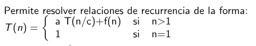
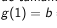
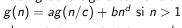

### D&C
Imaginemos que tenemos un progblema muy grande. Lo que busca el D&C es:

1. Dividir el problema grande en pedazos (subproblemas) más pequeños.
2. Resolver el cada uno de esos pedazos (generalmente volviendo a aplicar la misma receta, o sea, recursivamente)
3. Juntas las soluciones de los pedazos para formar la solucion del problema más grande.

> Ejemplo (Merge Sort).
>+ **Problema**: Ordenar una lista de 1000 números desordenados.
>+ **Dividir**: Parto la lista en dos mitades
>+ **Resolver**: Ordeno cada mitad (aplicando el mismo método)
>+ **Combinar**: Mezclo las dos mitades ya ordenadas para obtener la lista de  1000 elementos ordenada

> **OBS**: Lo importante es "Las subpartes tienen que ser más pequeñas Y ser el mismo tipo de tarea". Si divido el problema de ordenar una lista pero más chica, funciona. Pero si lo divido en "sumar números" es otro tipo de tarea completamente diferente, ya no es D&C.

### Forma General del D&C:

+ Caso base: "Si X es suficientemente chico"
+ Paso recursivo: Divido, resuelvo recursivamente, y finalmente combino.
XD

### ¿Cuánto tarda? (Matemática) :(
Lo primero que hacemos al analizar un algoritmo D&C es escribir su ecuación de recurrencia. La forma estándar que usamos es:

Donde:
+ **$T(n)$**: Es el tiempo que tarda el problema en resolver un problema de tamaño $n$.
+ **$a$**: Es el numero de subproblemas en los que dividimos al problema original.
    + Ejemplo (Busqueda Binaria): Busco en uno de las dos mitades.
    + Ejemplo (Merge Sort): Tengo que ordenar ambas mitades
+ **$n/c$**: Es el tamaño de cada subproblema.
    + Ejemplo: en el Merge Sort, cada mitad tiene tamaño $n/2$. $c = 2$.
+ **$f(n)$**: Es el costo de dividir el problema en subproblemas más el costo de combinar las soluciones de esos problemas para obtener la función final. Es un trabajo **No recursivo** que hacemos en cada nivel.

### La función $g(n)$:
La teórica introduce una función auxiliar llamada $g(n)$. Porque hay veces donde no sabemos el valor exacto de $T(1)$ o las constantes, asi que definimos una cota superior $g(n)$ que sabemos que no es mayor o igual que $T(n)$ para simplificar cuentas.

 

**$d$**: es el **Orden del polinomio** que acota el costo de dividir y combinar $f(n)$