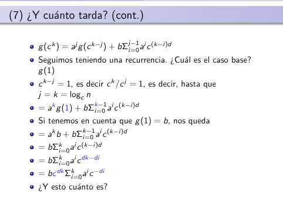

### D&C
Imaginemos que tenemos un progblema muy grande. Lo que busca el D&C es:

1. Dividir el problema grande en pedazos (subproblemas) más pequeños.
2. Resolver el cada uno de esos pedazos (generalmente volviendo a aplicar la misma receta, o sea, recursivamente)
3. Juntas las soluciones de los pedazos para formar la solucion del problema más grande.

> Ejemplo (Merge Sort).
>+ **Problema**: Ordenar una lista de 1000 números desordenados.
>+ **Dividir**: Parto la lista en dos mitades
>+ **Resolver**: Ordeno cada mitad (aplicando el mismo método)
>+ **Combinar**: Mezclo las dos mitades ya ordenadas para obtener la lista de  1000 elementos ordenada

> **OBS**: Lo importante es "Las subpartes tienen que ser más pequeñas Y ser el mismo tipo de tarea". Si divido el problema de ordenar una lista pero más chica, funciona. Pero si lo divido en "sumar números" es otro tipo de tarea completamente diferente, ya no es D&C.

### Forma General del D&C:

+ Caso base: "Si X es suficientemente chico"
+ Paso recursivo: Divido, resuelvo recursivamente, y finalmente combino.
XD

### ¿Cuánto tarda? (Matemática) :(
Lo primero que hacemos al analizar un algoritmo D&C es escribir su ecuación de recurrencia. La forma estándar que usamos es:

Donde:
+ **$T(n)$**: Es el tiempo que tarda el problema en resolver un problema de tamaño $n$.
+ **$a$**: Es el numero de subproblemas en los que dividimos al problema original.
    + Ejemplo (Busqueda Binaria): Busco en uno de las dos mitades.
    + Ejemplo (Merge Sort): Tengo que ordenar ambas mitades
+ **$n/c$**: Es el tamaño de cada subproblema.
    + Ejemplo: en el Merge Sort, cada mitad tiene tamaño $n/2$. $c = 2$.
+ **$f(n)$**: Es el costo de dividir el problema en subproblemas más el costo de combinar las soluciones de esos problemas para obtener la función final. Es un trabajo **No recursivo** que hacemos en cada nivel.

### La función $g(n)$:
La teórica introduce una función auxiliar llamada $g(n)$. Porque hay veces donde no sabemos el valor exacto de $T(1)$ o las constantes, asi que definimos una cota superior $g(n)$ que sabemos que no es mayor o igual que $T(n)$ para simplificar cuentas.

$g(1) = b$ (el costo base)

$g(n) = a g(n/c) + bn^d$ para $n > 1$

**$d$**: es el **Orden del polinomio** que acota el costo de dividir y combinar $f(n)$. Es decir $f(n) = O(n^d)$.

+ Si dividir y combinar es tiempo constante, entonces $d = 0$.
+ Si cuesta lineal, entonces $d = 1$.
+ Si cuesta cudrático, entonces $d = 2$.

### Página 7

La variable importante acá es $j$. $j$ representa "cuantos niveles hemos desenrollado".

La condición $c^{k-j} = 1$ significa que hemos llegado al caso base (tamaño 1). Despejando:

$ ck − j = 1  ⟹ k − j = 0 ⟹j = k$

Y como $n = c^k$, entonces $k = \log_c n$.

Esto nos dice que la profundidad del árbol de recursión es $\log_c n$.

### Análisis por Caso
Asumiendo que el costo de dividir/combinar es lineal ($d=1$). La variable crítica aquí es la relación entre $a$ y $c$.
Llegamos a esta expresión:

$T(n) ≤ bn \sum_{i=0}^{\log_c​n}{(a/c)^i}$

Estamos sumando, nivel por nivel (desde i = 0, hasta $i=\log_c n$ abajo), el costo de cada nivel. En el nivel $a^i$ subproblemas, cada uno de tamaño $(n/c)^i$ y el costo de procesar cada uno (sin contar la recursión más profunda) es $b \cdot (\text{tamaño})^d = b \cdot (n/c^i)^d$. Si $d=1$, es $b \cdot n/c^i$.

$g(n) \text{ nos queda como }\sum_{i=0}^{\log_c​n}{(a/c)^i}$

+ $a < c$
    + tengo pocos subproblemas ($a$) en relacion a lo mucho que se achican ($c$). En este caso cada nivel genera menos trabajo que el anterior porque $(a/c) < 1$.
    + $\sum_{i=0}^{\infty} (a/c)^i$ converge a una constante;
    + $T(n) = O(n)$. El trabajo pesado se hace en primer nivel. Los niveles recursivos aportan tan poco que no cambian el orden.

+ $a = c$
    + El número de subproblemas $a$ es exactamente el factor de división $c$. Esto significa que cada nivel tiene la misma cantidad total de trabajo que el anterior.
    + $\sum_{i=0}^{\log_c n} 1 = \log_c n + 1$.
    + $T(n) = O(n \log n)$. Todos los niveles del árbol de recursión cuestan lo mismo. Como hay $\log_c n$ niveles, el costo totales $n \cdot \log n$ 
    > Caso del Merge Sort.

+ $a > c$ (EXPLOSIÓN):
    + Tengo muchos subproblemas ($a$) y no se achican lo suficiente ($c$). Cada nivel genera más trabajo que el anterior porque $(a/c) > 1$.
    + $T(n) = O(n^{\log_c a})$ XD
    + Casi todo el trabajo del algoritmo se hace en las hojas del árbol de recursión (los caso base). El exponente $\log_c a$ es la "dimensión fractal" del algoritmo.

### Teorema Maestro
+ Si  $f(n) = O(n^{\log_c a - \epsilon})$ para algún $\epsilon > 0$ ($f(n)$ crece más lento que $n^{\log_c a}$).
    + La mayor parte del tiempo del algoritmo se consume en los niveles más profundos de la recursión (el caso base). El costo de dividir y juntar es insignificante comparado con la resolución de los problemas.

    + $T(n) = \Theta(n^{\log_c a})$

> Ejemplo de Wikipedia
>
> $T(n) = 8 T(n/2) + 1000n²$
>
> Como se puede ver en la formula de arriba:
>
> $a = 8$, $b = 2$, $f(n) = 1000n²$, entonces
>
> $f(n) = O(n^c)$, donde $c = 2$.
>
> Luego vemos si se cumple la condición:
>
>$\log_{b}{a} = \log_{2}{8} = 3 > c$.
>
> Luego por el teorema maestro tenemos que:
>
> T(n) = $\theta(n^{\log_b a}) = \theta(n^3)$ 